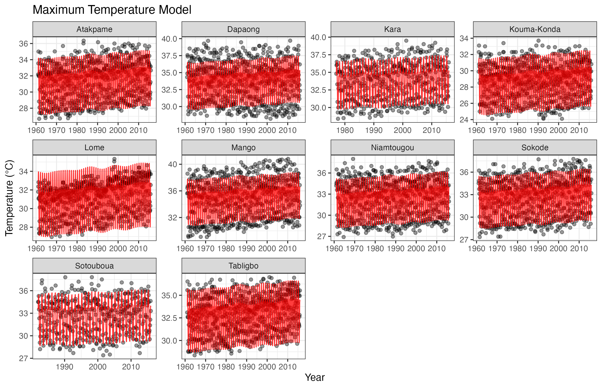
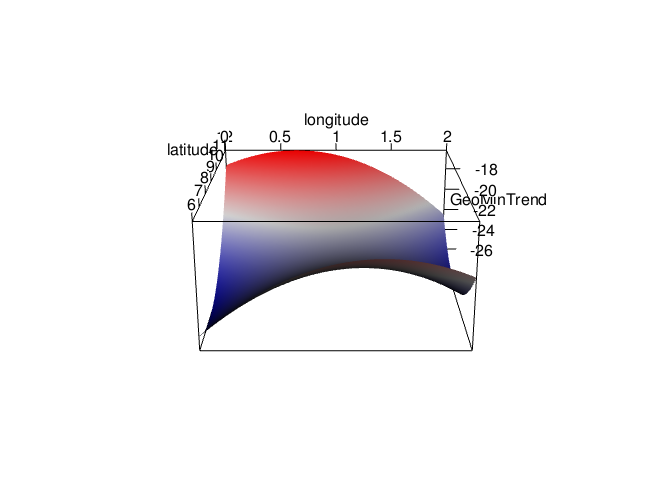
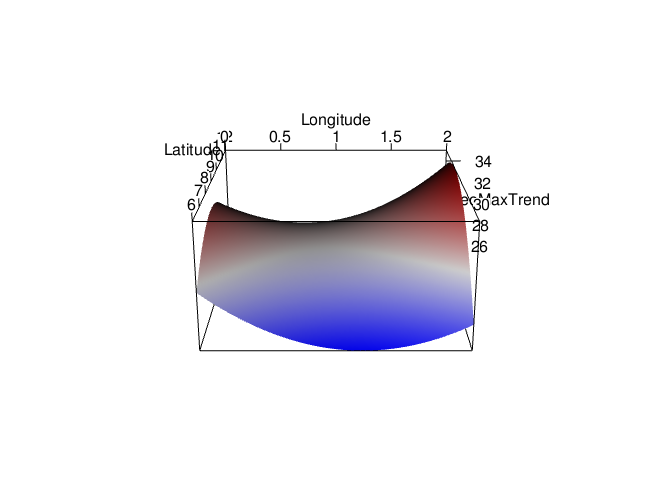

# Analysis of Historical Togolese Temperatures

This repository serves as a home for an analysis of historical monthly
minimum and maximum temperatures for 10 cities in the west African
nation of [Togo](https://en.wikipedia.org/wiki/Togo). The data were
obtained from Togolese meteorologists, and the cities include: Lomé,
Sokodé, Kara, Atakpamé, Mango, Dapaong, Niamtougou, Sotouboua, Tabligbo,
and Kouma Konda. The project project is organized as follows: - R:
collection of `R` scripts responsible for cleaning and imputing the raw
data, applying Singular Spectrum Analysis (SSA) to each city
individually, and development of global models. - Figures: all of the
figures generated by the R code. Mostly diagnostic plots from the SSA
phase where seasonal components were manually selected. - Presentations:
a collection of presentations given at different conferences by myself
and/or Professor Andy Long

The main component of the analysis is the identification of important
seasonal trends in both sets of temperature data. This is done manually
using singular spectrum analysis (SSA). Resulting periods are then
incorporated into linear mixed models which also include a random
intercept for location and geographical parameters (elevation,
longitude, and latitude).

## Global Models


As far as minimum monthly average temperatures go, we see an overall
average increasing trend of approximately .032 $^\circ$C per year. Some
cities, such as Mango, have much greater variability in temperatures,
but the trend persists. In other cities like Niamtougou, observed
temperatures do not appear to be rising as dramatically, but we still
expect an increase due to the overall global trend.



In the average monthly maximum temperatures, the increasing trend of
0.019 $^\circ$C per year is not quite as alarming as the trend in the
minima, but worrisome nonetheless. Once again, there is heterogeneity
across cities, but the global trend persist throughout most and the
singular spectrum analysis appears to have adequately captured seasonal
trends.

## 3D Visualization of the impact of Geography

Here I’ve included an interactive 3D visualization of the impact of
latitude and longitude on both models. Feel free to play around with
these some.

``` r
# Minimum temperature model
min_geo_coef <- coef(summary(min_model))[c('Longitude','Latitude', 
                                           'I(Latitude^2)','I(Longitude^2)',
                                           'I(Latitude * Longitude)'),
                                         'Estimate']
min_geo <- function(long, lat){
  cbind(long, lat, lat^2, long^2, long*lat) %*% min_geo_coef
}
rgl::open3d()
```

    ## null 
    ##    5

``` r
rgl::plot3d(min_geo, 
            col = colorRampPalette(c("blue", "white", "red")), 
            xlab = "longitude", ylab = "latitude", zlab = "GeoMinTrend", 
            xlim = c(0,2), ylim = c(6,12),
            aspect = c(1, 1, 0.5))
```

<!-- -->

``` r
# Maximum temperature model
max_geo_coef <- coef(summary(max_model))[c('Longitude','Latitude', 
                                           'I(Latitude^2)','I(Longitude^2)',
                                           'I(Latitude * Longitude)'),
                                         'Estimate']

max_geo <- function(long, lat){
  cbind(long, lat, lat^2, long^2, long*lat) %*% max_geo_coef
}

rgl::open3d()
```

    ## null 
    ##    9

``` r
rgl::plot3d(max_geo, 
            col = colorRampPalette(c("blue", "white", "red")), 
            xlab = "Longitude", ylab = "Latitude", zlab = "GeoMaxTrend", 
            xlim = c(0,2), ylim = c(6,12),
            aspect = c(1, 1, 0.5))
```

<!-- -->
